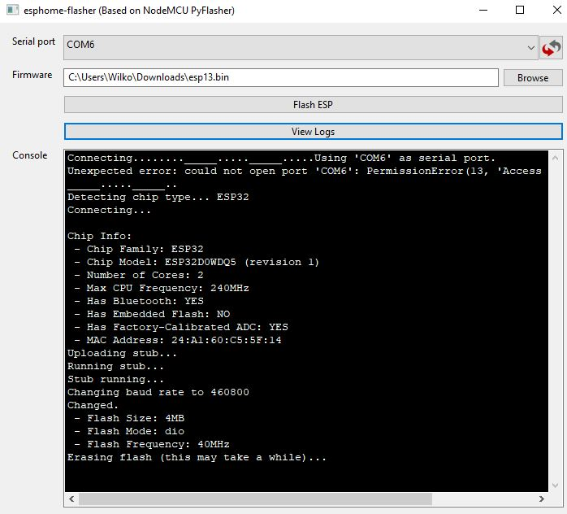
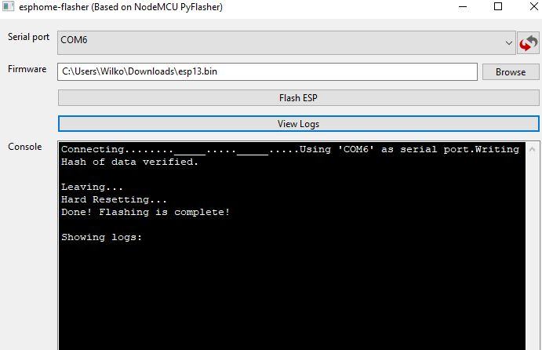
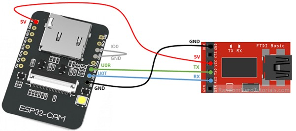

# ESPHome
ESPHome is an addon to Home Assistant which enables low code home automation.

## Description and operation instructions
ESPHome supports many devices and easily integrates them into Home Assistant by specifying them via YAML. ESPHome has several methods for deploying the code to the different boards. To my experience this is way easier then via ESP easy flashers, ArduinoIO or PlatformIO. Detailed info can be found https://esphome.io/.


 ## Technical description installing the Addon into Home Assistant
- Open Home Assistant
- Enter the 'Supervisor panel'
- Select the 'Add-on store' and search for ESPHome
- Install ESPHome
- Enable all toggles for 'ESPHome starts at boot', 'Watchdog', 'Autoupdate' and 'Show in sidebar'
- Click 'Start' to run ESPHome
- Find the ESPHome icon in the sidebar
- There are not devices yet 

## Technical description initial config of ESPHome
- Open Home Assistant
- Find the ESPHome icon in the sidebar
Before adding devices it is best practice to set the credentials of Wifi first in the secrets document.
- Click on 'secrets'
- Add the credentials of wifi
```
wifi_ssid: "..xx.."
wifi_password: "....xxxxx.."
```

- Save the file

## Technical description adding devices via ESPHome
It is time to add devices
- Click the '+'
- Add name and wifi settings (the settings will be overwritten once the device is created, so it doesn't matter what to fill in for wifi)
- Next
- Select 'Pick specific board' and use this table to select the correct board:

| Board           | Select               |
|-----------------|----------------------|
| ESP32-WROOM-32x | DOIT ESP32 DEVKIT V1 |
| ESP32-cam       | AI Thinker ESP32-CAM |

- Next
- Click 'Edit'once the device is made
- Replace the wifi section by:
```
wifi:
  ssid: !secret wifi_ssid
  password: !secret wifi_password
```

Place the specific code under "captive_portal:"
- Save

### Initial firmware installation onto the device
New devices don't have OTA (Over The Air) installed so the first time this is manually.
- In the overview with all ESPHome devices select the device and hit 'Edit'
- Click 'Install'
- Click 'Manual download'. The firmware will be created.
- Once ready, download the firmware.

#### Flasher
Only needed for the initial firmware installation. Once ready the OTA can be used. 
- Download the firmware flasher at https://github.com/esphome/esphome-flasher/releases.
- For ESP32 devices that doesn't require a FTDI, the ESP can be connected to the computer and the flasher may be run. For devices that need an FTDI see the next paragraph for connecting the ESP to the FTDI and the computer. Once connected, continue here.
- Select the 'serial port' and the downloaded firmware
- Click 'Flash ESP'
- Some devices like the ESP32-CAM need to connect the pin 100 to GND and the reset button needs to be pressed before the flashing can proceed



When everything was successfull:



- Once ready reboot the ESP
- After the ESP is booted it should become online in Home Assistant in ESPHome and as newly discovered device under 'Integrations'.
- Click the discovered device and submit it to add to Home Assistant

### Schematic overview to initially upload firmware to device that doesn't have an FTDI like the ESP32-CAM



Connect the ESP32-Cam to the FTDI: Many FTDI programmers have a jumper that allows you to select 3.3V or 5V. Make sure the jumper is in the right place to select 5V. ESP32-CAM FTDI Programmer GND GND 5V VCC (5V) U0R TX U0T RX GPIO 0 GND Important: 
- GPIO 0 needs to be connected to GND so that you’re able to upload code. 
- Make sure to connect an external power supply to the 5V otherwise there are errors when flashing or the flashing will not work at all. 

### Firmware updates of ESPHome devices
- In Home Assistant go into the tab HomeESP
- Make the needed changes and upload over the air


### ESPHome Configuration
Make the necessary changes to the configuration of the ESP32-CAM camera: [ESP32CAM configurations](https://esphome.io/components/esp32_camera.html) and place them into the YAML file. Upload to the device once the configuration is ready.

### Interface
#### Home Assistant
The devices will automatically be added via the discovery process of the integration into Home Assistant. The Notification icon in Home Assistant will indicate that there is a new device discovered. Click it and complete the process. The device is no available in Home Assistant.

### Fixed IP address
There are two options:
- Via the DHCP server in Ubiquity
- Via the settings of the device in ESPHome
Ubiquity is chosen to configure the fixed IP as the naming then can be adjusted to a more logical one. Ubiquity provides one central location to set fixed IP addresses and captures the MAC address for administration in the IP plan.

### Testing
Add the device to the dashboard and check the results.
The ESP32-CAM will capture images, but with a slow framerate. This is to reduce the power consumption of the ESP32-CAM when not in use. By clicking on the camera image the framerate increases and the power consumption with it.

## Examples
- [Display text on the SSD1306](/Examples/SSD1306_i2C_display_text)
- [Display time on the SSD1306](/Examples/SSD1306_i2C_display_time)
- [Display a value from Home Assistant on the SSD1306](/Examples/SSD1306_i2C_display_Value_Entity_HA)
- [Display lines or circles on the SSD1306](/Examples/SSD1306_i2C_display_Line)
- [Display a graph on the SSD1306](/Examples/SSD1306_i2C_display_Graph)
- [Display on when a button is pressed](/Examples/SSD1306_i2C_display_On_Off)

### Information
- [ESPHome Automations and Templates](https://esphome.io/guides/automations.html)
- [ESPHome GPIO Binary Sensor](https://esphome.io/components/binary_sensor/gpio.html)
- [ESPHome Binary Sensor Component](https://esphome.io/components/binary_sensor/index.html#config-binary-sensor)
- [ESPHome Configuration Types](https://esphome.io/guides/configuration-types.html#config-pin-schema)
- [ESPHome syntax for writing text in the yaml file to be printed on a LCD](https://esphome.io/components/display/index.html#display-printf)
- [ESP32 Pinout reference](https://randomnerdtutorials.com/esp32-pinout-reference-gpios)
- [ESP32-WROOM-32x](https://esphome.io/devices/nodemcu_esp32.html)
- [Boards & dev-kits](https://platformio.org/boards?count=1000&filter%5Bplatform%5D=espressif32)

Generic
- [Markdown Cheat Sheet](https://www.markdownguide.org/cheat-sheet/)


### Problems
..

### Wishlist
..


### Code
..
```
..
```
