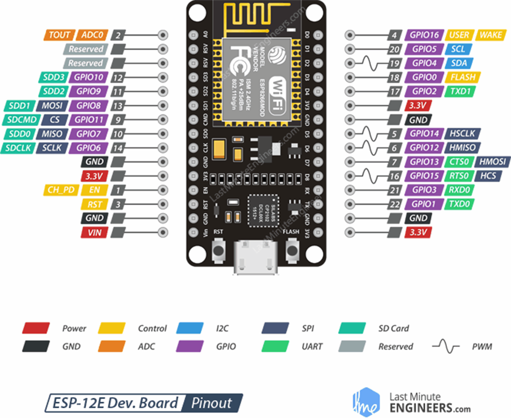
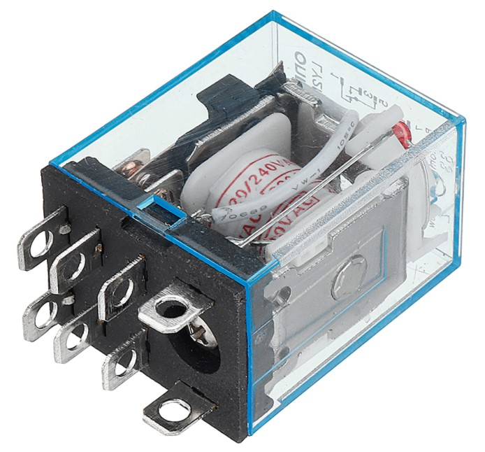
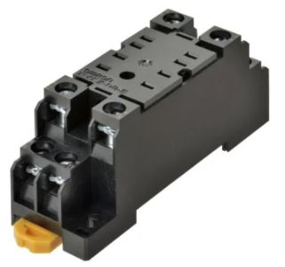
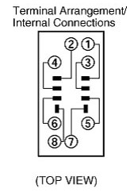
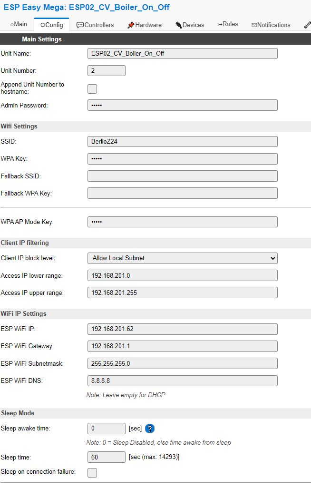
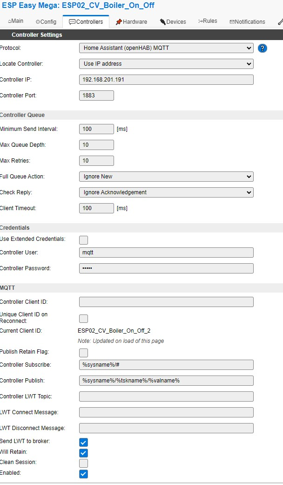
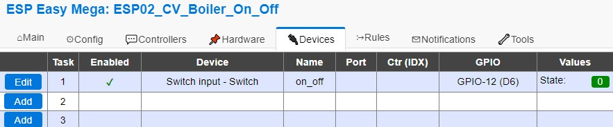
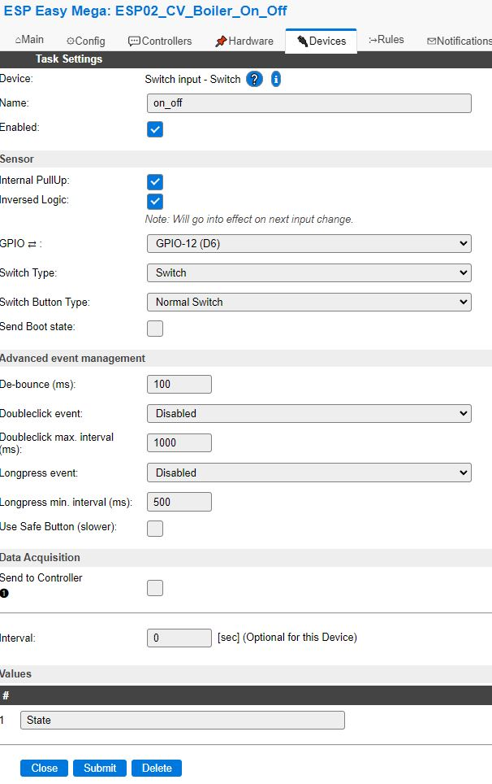

# ESPHome
ESPHome is an addon to Home Assistant which enables low code home automation.

## Description and operation instructions
ESPHome supports many devices and easily integrates them into Home Assistant by specifying them via YAML. ESPHome has several methods for deploying the code to the different boards. To my experience this is way easier then via ESP easy flashers, ArduinoIO or PlatformIO. Detailed info can be found https://esphome.io/.


 ## Technical description installing the Addon into Home Assistant
- Open Home Assistant
- Enter the 'Supervisor panel'
- Select the 'Add-on store' and search for ESPHome
- Install ESPHome
- Enable all toggles for 'ESPHome starts at boot', 'Watchdog', 'Autoupdate' and 'Show in sidebar'
- Click 'Start' to run ESPHome
- Find the ESPHome icon in the sidebar
- There are not devices yet 

## Technical description adding devices via ESPHome
- Open Home Assistant
- Find the ESPHome icon in the sidebar
Before adding devices it is best practice to set the credentials of Wifi first in the secrets document.
- Click on 'secrets'
- Add the credentials of wifi
```
wifi_ssid: "BerlioZ24"
wifi_password: "....xxxxx.."
```
- Save the file
It is time to add devices
- Click the '+'
- Add name and wifi settings (the settings will be overwritten once the device is created, so it doesn't matter what to fill in for wifi)
- Next
- Select 'Pick specific board' and use this table to select the correct board:
ESP32-WROOM-32x     DOIT ESP32 DEVKIT V1
ESP32-cam           AI Thinker ESP32-CAM
- Next
- Click 'Edit'once the device is made
- Replace the wifi section by:
```
wifi:
  ssid: !secret wifi_ssid
  password: !secret wifi_password
```
- Save

### Initial firmware installation onto the device
New devices don't have OTA (Over The Air) installed so the first time this is manually.
- In the overview with all ESPHome devices select the device and hit 'Edit'
- Click 'Install'
- Click 'Manual download'. The firmware will be created.
- Once ready, download the firmware.

#### Flasher
Only needed for the initial firmware installation. 
- Download the firmware flasher at https://github.com/esphome/esphome-flasher/releases.
- For ESP32 devices that doesn't require a FTDI, the ESP can be connected to the computer and the flasher may be run. For devices that need an FTDI see the next paragraph for connecting the ESP to the FTDI and the computer.
- Select the 'serial port' and the downloaded firmware
- Click 'Flash ESP'
- Once ready reboot the ESP
- After the ESP is booted it should become visible in Home Assistant in ESPHome


### Schematic overview to initially upload firmware to device that doesn't have an FTDI like the ESP32-CAM


Connect the ESP32-Cam to the FTDI: Many FTDI programmers have a jumper that allows you to select 3.3V or 5V. Make sure the jumper is in the right place to select 5V. ESP32-CAM FTDI Programmer GND GND 5V VCC (5V) U0R TX U0T RX GPIO 0 GND Important: 
- GPIO 0 needs to be connected to GND so that you’re able to upload code. 
- Make sure to connect an external power supply to the 5V otherwise there are errors when flashing or the flashing will not work at all. 


### Parts
1 x NodeMCU



1 x Relay LY2N-J



1 x Relay socket PTF08A



Relay socket pinout



1 x 10k resistor as pull down resistor


### ESPEasy installation
See the instructions in 'Arduino projects and programming' (not listed here)


### ESPEasy Configuration
Check the screenshots for the configuration.







Pay attention to the Pullup and inverse as there were issues even with the external pulldown resistor.
Additionally when using relais make sure to set a debounce value to make sure that the contacts of the relais don't mess with the state.


### Interface
#### Home Assistant
Home Assistant is connected via the MQTT broker.

### Testing
.

### Information
- [ESP32-WROOM-32x](https://esphome.io/devices/nodemcu_esp32.html)

Generic
- [Markdown Cheat Sheet](https://www.markdownguide.org/cheat-sheet/)


### Problems
..

### Wishlist
..


### Code
#### Rules Set 1 without annotation

#### Rules Set 1 including annotation
```
..
```
